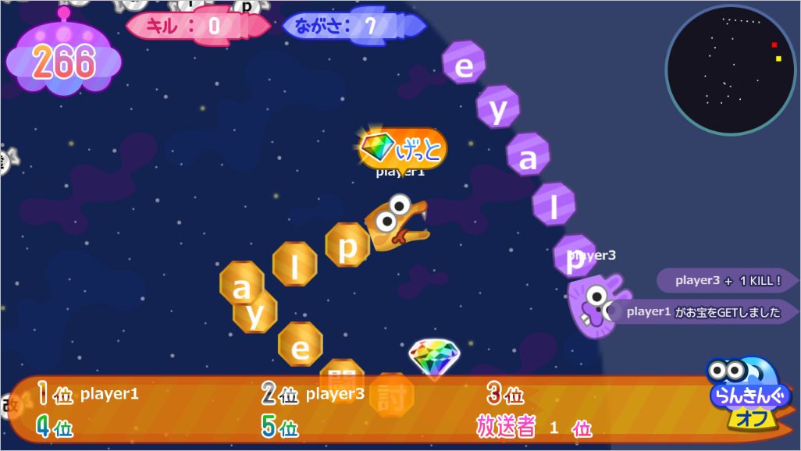

ニコニコスネーク
=============

[Akashic Engine](https://akashic-games.github.io/) で作られたマルチプレイゲームです。



## ニコ生ゲーム公式版とOSS版との違い

- 公式版にある以下の機能は、自作ゲームでは利用できないため削除しています
  - プレミアム登録機能
  - シェア機能
- 一部の文字素材がライセンスの関係で公式版と異なっています

## ビルド方法

TypeScriptで作られています。以下のコマンドで、このリポジトリをクローンしてビルドしてください。

```
git clone git@github.com:akashic-contents/niconicoSnake.git
cd niconicoSnake
npm install
npm run build
```

## 実行方法

以下のコマンドで akashic serve が起動されます。起動後、自動的にブラウザで akashic serve のプレイ画面が開きます。

```
npm run serve # または akashic serve --target-service nicolive
```

akashic serve 画面左上の「インスタンスを追加」ボタンを押すとブラウザのプレイ画面が新しく開き、マルチプレイで遊ぶ人数を増やすことができます。

### --target-service nicolive オプションを付けていない場合

akashic serve 画面右上の「三」からDevtoolを開き、 Events タブから「default」を選んで Send を押します。（既定のセッションパラメータがコンテンツに送信されます）

放送者として振舞うプレイ画面で「Join Me」ボタンを押し、ゲームを開始します。

## セッションパラメータ

### SnakeGameSessionParameter
```
/**
 * 参加者受付時間 [sec]
 * 省略時は 10sec
 */
entrySec?: number;

/**
 * 参加可能最大人数 (放送者を除く)
 * 省略時は 99人
 */
numPlayers?: number;

/**
 * あそびかたの説明文言
 */
howtoMessage?: string;

/**
 * プレミアム会員の当選ウェイト
 * 省略時は 2.5
 */
premiumWeight?: number;

/**
 * ゲーム関連 (以下参照)
 */
config?: GameConfig;
```

### GameConfig
```
field: {
	/**
	* 円形フィールド半径[px] 配列
	* 参加人数、生存スネーク数に依存
	* 要素数は 5
	* 省略時は [1800, 1600, 1400, 1200, 1000]
	*/
	radius: number[];

	/**
	* 毎秒縮小するフィールド半径[px]
	* 省略時は 5px
	*/
	narrowRadiusPerSec: number;

	/**
	* 背景透過度
	* 省略時は 0.8
	*/
	bgOpacity: number
};

food: {
	/**
	* エサの出現間隔[ミリ秒]
	* 省略時は 10000ms
	*/ 
	interval: number;

	/**
	* 一度に出るエサの数
	* 現段階のフィールドの大きさに依存
	* 配列要素数は field#radius: number[] の要素数と一致させる必要がある
	* 省略時は [5, 5, 5, 5, 5]
	*/
	volume: number[]
};

snake: {
	/**
	* ダッシュ継続時間[sec]
	* 省略時は 3sec
	*/
	dashingTime: number;

	/**
	* 基本速度
	* 省略時は 5
	*/
	baseSpeed: number;

	/**
	* 最大速度
	* 基本速度に対する倍率。2なら最大2倍速
	* 省略時は 4
	*/
	maxSpeedScale: number;

	/**
	* 毎フレームごとのダッシュゲージ回復量
	* ゲージ最大値は dashingTime * g.game.fps
	* 省略時は 1
	*/
	amountDashingGaugeRecoveryPerFrame: number;

	/**
	* ゲーム開始、リスポーン時の名前として使える最大文字数
	* 省略時は 5
	*/
	maxNameLength: number;

	/**
	* 表示するスネークの最大節数
	* 設定値より多くのエサを食べた場合は、スコア集計されるが、表示はされず、スネークの頭側に節が移動する形で更新される
	* 省略時は 30
	*/
	maxKnotLength: number;

	/**
	* 一般会員のリスポーン回数
	* 省略時は 0
	*/
	respawnTimes: number;

	/**
	* プレミアム会員のリスポーン回数
	* 省略時は 1
	*/
	premiumRespawnTimes: number;

	/**
	* 無敵時間[ミリ秒]
	* 省略時は 10000ms
	*/
	invincibleTime: number
};

time: {
	/**
	* 制限時間の有無
	* 省略時は true
	*/
	isTimeBased: boolean;

	/**
	* 制限時間 [sec]
	* 省略時は 300sec
	*/
	limit: number
};

userInput: {
	/**
	* 操作が移動方向に反映されるpointDown位置からの移動距離の閾値
	* 省略時は 30
	*/
	pointMoveDistance: number;

	/**
	* ダブルタップ判定される時間の閾値
	* g.game.ageの経過時間がこの閾値以下の場合はダブルタップとみなされる
	* 省略時は 0.1
	*/
	doublePointDuration: number;

	/**
	* 移動方向の分割数（整数）
	* 増やすほど細かい方向制御できるがイベント頻度が増える
	* 省略時は 72
	*/
	radianFineness: number
};

audio: {
	/**
	* オーディオマスターボリューム
	* 省略時は 1.0
	*/
	audioVolume: number
};

//* * デバッグ用途のみで使う */
debug?: {
	/**
	* 抽選をスキップして、一人プレイでゲーム開始（デバック用）
	*/
	skipLottery: boolean;

	/**
	* ランダムに利用されるプレイヤー名
	*/
	playerNames: string[];

	/**
	* デバッグ時のオーディオマスターボリューム
	*/
	audioVolume: number;

	/**
	* 人数によるゲーム終了条件を無効にする
	*/
	banEndingGameByNumberOfPlayers: boolean

};
```
## ライセンス

本リポジトリは MIT License の元で公開されています。
詳しくは [LICENSE](./LICENSE) をご覧ください。
 
ただし、画像ファイルおよび音声ファイルは
[CC BY 2.1 JP](https://creativecommons.org/licenses/by/2.1/jp/) の元で公開されています。